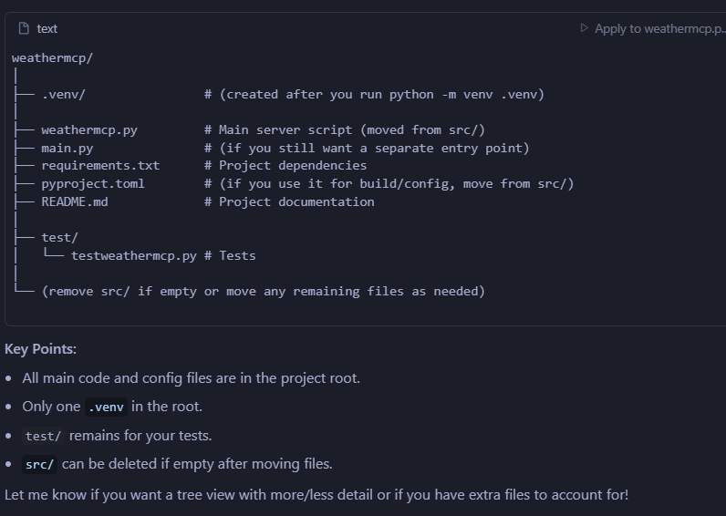
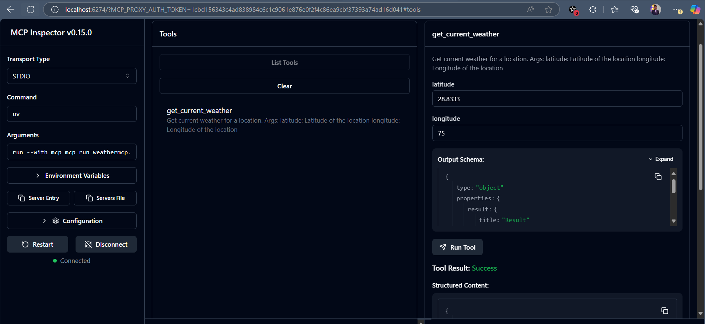
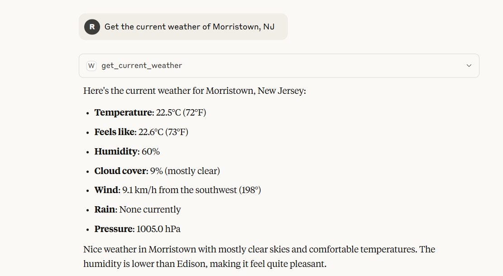

# WeatherMCP

A simple weather server using FastMCP and the Open-Meteo API. This project provides weather data via an MCP-compatible server, suitable for integration with MCP clients and tools.

## Project structure


## Features
- Fetches current weather data for a given latitude and longitude using the Open-Meteo API
- Implements the FastMCP server interface
- Includes logging for debugging and tracing requests

## Requirements
- Python 3.10 or newer
- [httpx](https://www.python-httpx.org/)
- [mcp[cli]](https://pypi.org/project/mcp/)

## Setup

1. **Clone the repository and navigate to the project root:**
   ```sh
   cd D:\mcp-servers\weathermcp
   ```

2. **Create a virtual environment in the project root:**
   ```sh
   python -m venv .venv
   
   ```

3. **Activate the virtual environment:**
   - Command Prompt:
     ```sh
     .venv\Scripts\activate.bat
     ```
   
4. **Install dependencies:**
   ```sh
   pip install -r requirements.txt
   uv install mcp  
   ```

5. **(Optional, for local SSL issues)**
   If you encounter SSL certificate errors, you can temporarily disable SSL verification in the code (already set in this project for local testing):
   ```python
   async with httpx.AsyncClient(verify=False) as client:
   ```
   **Note:** This is insecure and should only be used for local development.

## Running the MCP Server Locally

To start the WeatherMCP server:
mcp dev weathermcp.py

The server will start and listen for MCP requests. You can test it using an MCP-compatible client or via a web interface (if available), e.g.:
```
http://localhost:6274/?MCP_PROXY_AUTH_TOKEN=YOUR_TOKEN#tools
```



## Claude Desktop (Windows)
**Add following in "C:\Users\rsharma\AppData\Roaming\Claude\claude_desktop_config.json"  (Change path as per your system in following configuration)**
 "weather": {
      "command": "/Users/rsharma/.local/bin/uv",
      "args": [
        "run",
        "--with",
        "mcp[cli]",
        "mcp",
        "run",
        "D:\\mcp-servers\\weathermcp\\weathermcp.py"
      ]
    }



## Troubleshooting
- Ensure you are using Python 3.10 or newer.
- Activate the correct virtual environment before installing dependencies or running the server.
- If you see port-in-use errors, make sure no other process is using the MCP server port (default: 6277).
- For SSL errors, see the setup section above.

Reference:
https://www.linkedin.com/learning/model-context-protocol-mcp-hands-on-with-agentic-ai/articles/building-an-advanced-mcp-using-typescript?autoSkip=true&resume=false&u=107510562

## License
MIT
